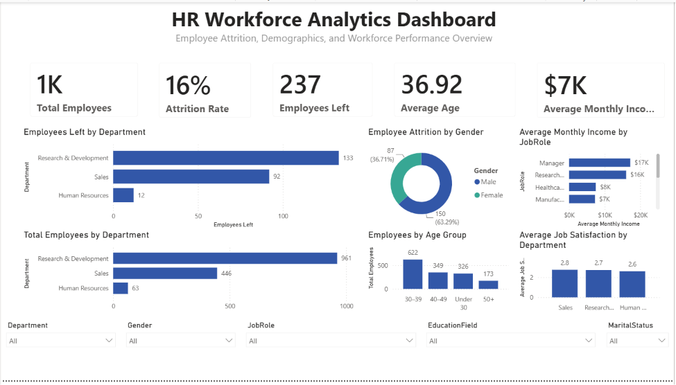
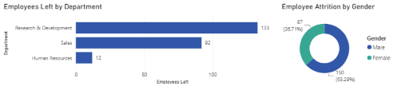

# HR Workforce Analytics Dashboard

## Project Overview

The HR Workforce Analytics Dashboard is an interactive Power BI project designed to help Human Resources professionals and business leaders analyze workforce trends, monitor employee attrition, and make data-driven decisions. Using the IBM HR Analytics Employee Attrition dataset, the dashboard provides insights into employee demographics, compensation, job satisfaction, and workforce retention through interactive visualizations and key performance indicators (KPIs).

---

## Business Problem

Organizations need accurate and timely workforce insights to improve employee retention and support strategic planning. Traditional reporting methods are often time-consuming and make it difficult to identify patterns in employee turnover, satisfaction, and departmental performance. This dashboard centralizes HR metrics into an interactive report that enables faster analysis and informed decision-making.

---

## Project Objectives

* Monitor overall workforce health using key HR metrics.
* Measure employee attrition across departments and demographics.
* Analyze salary, tenure, and job satisfaction trends.
* Compare workforce distribution by department and job role.
* Provide leadership with an interactive dashboard for workforce planning.

---

## Dataset

**Source:** IBM HR Analytics Employee Attrition & Performance Dataset (Kaggle)

**Industry:** Human Resources

**Records:** 1,470 employees

**Features:** 35 employee attributes including age, department, job role, education, monthly income, performance rating, work-life balance, years at company, and attrition status.

---

## Tools & Technologies

* Power BI
* Power Query
* DAX
* Microsoft Excel
* GitHub

---

## Data Preparation

The dataset was prepared using Power Query before analysis.

Cleaning steps included:

* Verified and corrected data types
* Checked for missing values
* Removed duplicate employee records
* Removed unnecessary columns
* Renamed columns for readability
* Created calculated columns and DAX measures for KPI reporting

---

## Dashboard Features

The dashboard includes:

* KPI Cards

  * Total Employees
  * Employees Left
  * Active Employees
  * Attrition Rate
  * Average Age
  * Average Monthly Income

* Interactive Visualizations

  * Employee Attrition by Department
  * Employees by Department
  * Employee Attrition by Gender
  * Employees by Age Group
  * Average Monthly Income by Job Role
  * Average Job Satisfaction by Department

* Interactive Slicers

  * Department
  * Gender
  * Job Role
  * Education Field
  * Marital Status

---

## Key Insights

Analysis of the workforce data identified several important trends:

* Sales experienced the highest employee attrition.
* Research & Development had the largest workforce.
* Employees with shorter tenure showed higher turnover rates.
* Lower job satisfaction was associated with higher attrition.
* Monthly income varied significantly across job roles.

---

## Business Recommendations

Based on the analysis, organizations should consider:

* Strengthening onboarding and retention programs for newer employees.
* Increasing employee engagement initiatives in high-turnover departments.
* Monitoring employee satisfaction through regular surveys.
* Reviewing compensation strategies for lower-paid job roles.
* Expanding career development and internal promotion opportunities.

---

## Estimated Business Impact

Although this is a portfolio project using a public dataset, the dashboard demonstrates how workforce analytics can support business decisions.

Potential benefits include:

* Up to an estimated 8–12% reduction in employee attrition through targeted retention strategies.
* Approximately 60% faster HR reporting using automated dashboards.
* Improved workforce planning through centralized KPI monitoring.
* More informed executive decision-making using interactive reporting.

---

## Repository Structure

```text
HR-Workforce-Analytics-Dashboard
│
├── Data
├── Images
├── PowerBI
├── Presentation
├── README.md
└── LICENSE
```

---

## Dashboard Preview

### Executive Dashboard




### Attrition Analysis



---

## Skills Demonstrated

* Power BI
* Power Query
* DAX
* Data Cleaning
* Data Modeling
* Data Visualization
* Dashboard Design
* KPI Development
* HR Analytics
* Business Intelligence
* Problem Solving
* Stakeholder Communication

---

## Future Enhancements

Potential improvements for future versions include:

* Predictive attrition modeling using machine learning.
* Time-series workforce trend analysis.
* Department-level drill-through pages.
* Additional executive scorecards and benchmarking metrics.
* Integration with live HR information systems.

---

## Author

**Camron Gayle**

Bachelor of Science in Computer Science

Minor in Cybersecurity

Passionate about data analytics, business intelligence, and building interactive dashboards that transform data into actionable insights.
